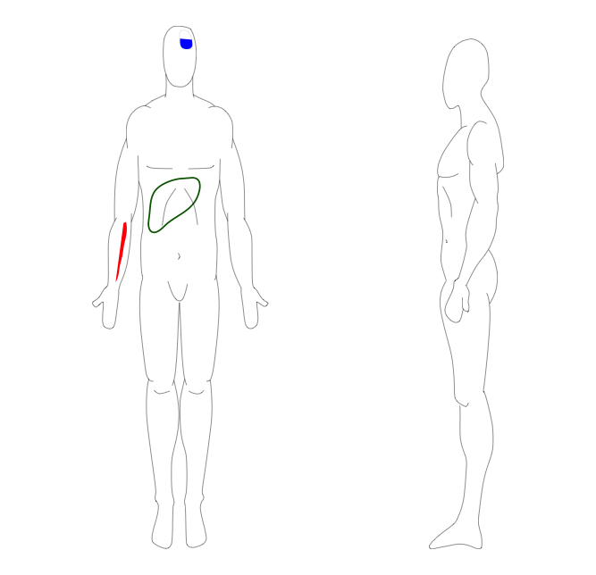

# SHollizeckPackage

<!-- badges: start -->
[](https://www.tidyverse.org/lifecycle/#experimental)
<!-- badges: end -->

This package contains the agglomeration of R functionality I have written for my PhD so far.
It contains parts for visualisation as well as pure data crunching, so there should be something for everyone.

## Installation

You can install the released version of SHollizeckPackage from [GitHub](https://github.com/SebastianHollizeck/SHollizeckPackage) with:

``` r
# install.packages("devtools")
devtools::install_github("SebastianHollizeck/SHollizeckPackage")
```

## Example

Plotting lesions sites in a human body

``` r
library(SHollizeckPackage)

mappingXML <- loadXML()
changePlottingStyle(mappingXML, "right_spook", color="red")
changePlottingStyle(mappingXML, "left_lower_brain", color="blue")
changePlottingStyle(mappingXML, "liver", style='stroke', lwd=20, color="darkgreen")
drawXML(mappingXML)
```



